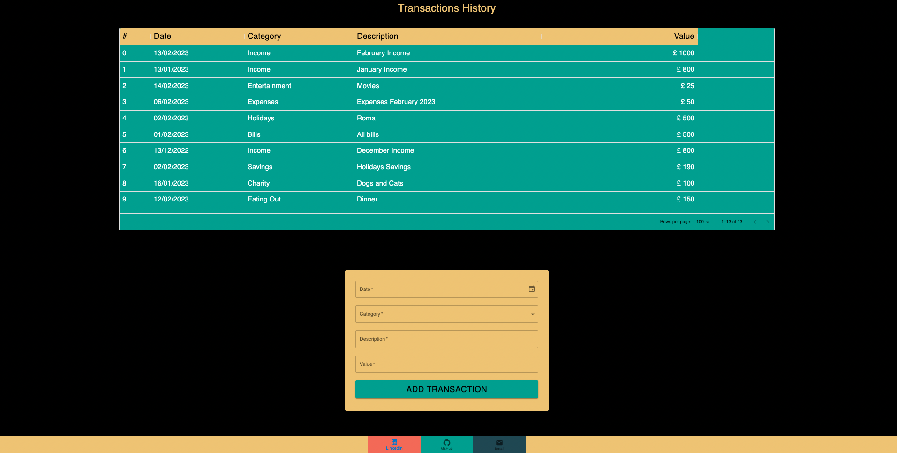

## My_Monies

My monies is a financial tracker and dashboard created with React and Material UI. 
It was part of the final project for the Trilogy’s Skills Bootcamp in Front-End Web Development(edX).
The colour palette and general style was modified for this version.  
## Description

The app allows to add transactions to 10 different categories : Bills, Charity, Eating out, Entertainment, Expenses, Groceries, Holidays, Savings, Shopping, Transport. 

The new transactions will be stored on the local storage . 

Base on the information stored the dashboard will show different charts , graphics and tables with calculate data. 

## Screenshots

## Table of Contents

- [Description](#description)
- [Screenshots](#screenshots)
- [Usage](#usage)
- [Credits](#credits)
- [License](#license)
- [Questions](#questions)

## Usage

run npm start

## Credits

- [Material UI](https://mui.com/)
- [Joy UI](https://mui.com/joy-ui/getting-started/overview/)
- [MomentJs](https://momentjs.com/)
- [Recharts](https://recharts.org/en-US)
- [Vecteezy](https://www.vecteezy.com/)

## License

MIT License

Copyright (c) 2023 Sabrina Martorelli

Permission is hereby granted, free of charge, to any person obtaining a copy
of this software and associated documentation files (the "Software"), to deal
in the Software without restriction, including without limitation the rights
to use, copy, modify, merge, publish, distribute, sublicense, and/or sell
copies of the Software, and to permit persons to whom the Software is
furnished to do so, subject to the following conditions:

The above copyright notice and this permission notice shall be included in all
copies or substantial portions of the Software.

THE SOFTWARE IS PROVIDED "AS IS", WITHOUT WARRANTY OF ANY KIND, EXPRESS OR
IMPLIED, INCLUDING BUT NOT LIMITED TO THE WARRANTIES OF MERCHANTABILITY,
FITNESS FOR A PARTICULAR PURPOSE AND NONINFRINGEMENT. IN NO EVENT SHALL THE
AUTHORS OR COPYRIGHT HOLDERS BE LIABLE FOR ANY CLAIM, DAMAGES OR OTHER
LIABILITY, WHETHER IN AN ACTION OF CONTRACT, TORT OR OTHERWISE, ARISING FROM,
OUT OF OR IN CONNECTION WITH THE SOFTWARE OR THE USE OR OTHER DEALINGS IN THE
SOFTWARE.

##  Questions

 Additional questions? Please contact me at [sabrina.martorelli@gmail.com ](mailto:sabrina.martorelli@gmail.com).